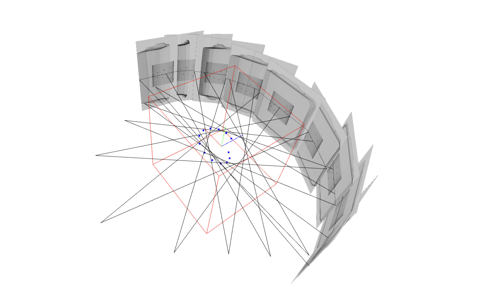
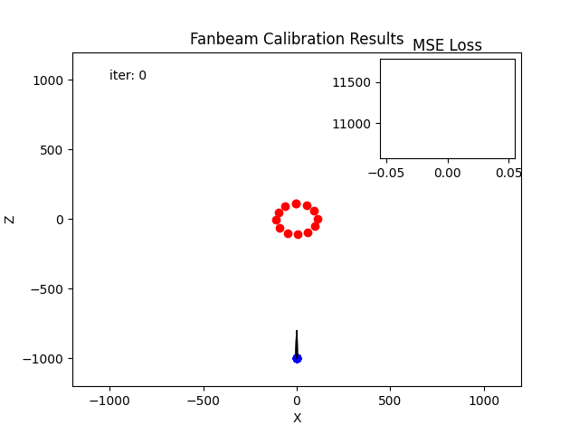
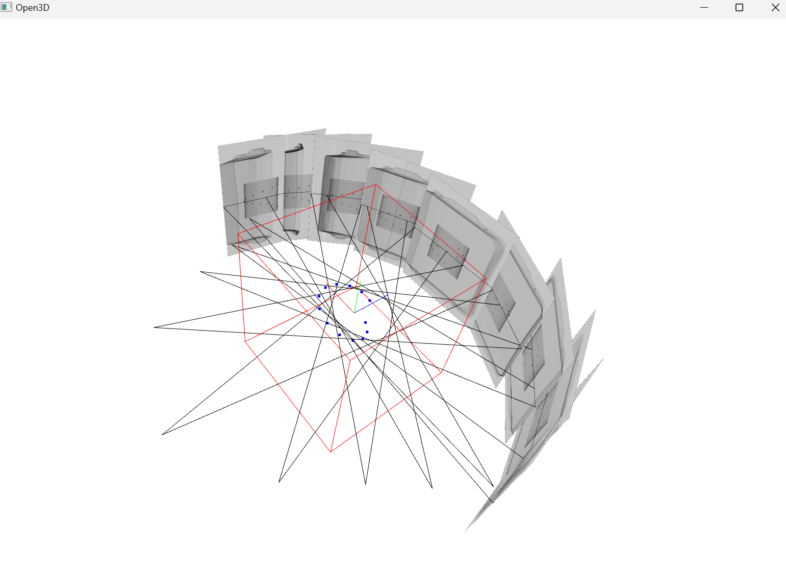
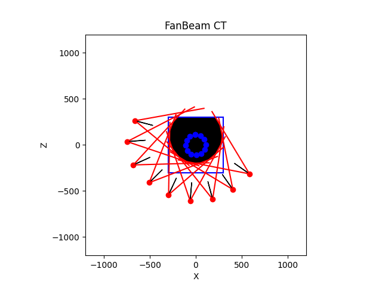
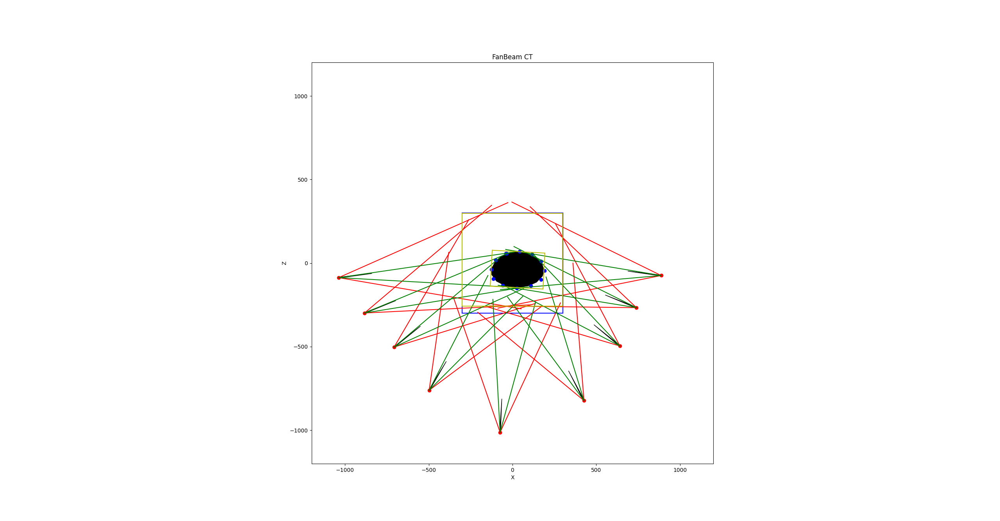
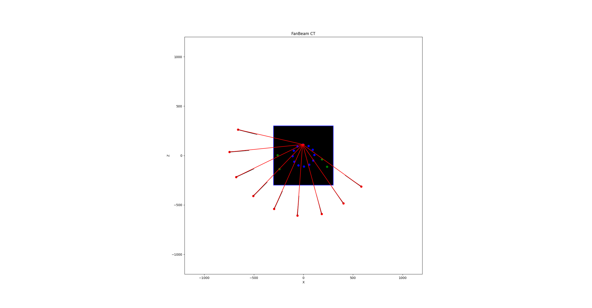
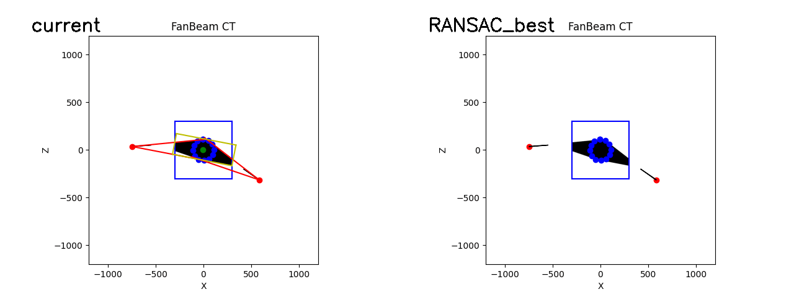

<p align="center">

  <h1 align="center">9-view X-ray Fanbeam Calibration</h1>
  <p align="center">
    <a href="https://www.cubox.ai/"><strong>SECERN AI</strong></a><sup></sup>
  <div align="center">
    
  </div>

  <p align="center">
    <a href='https://github.com/yc4ny/Fanbeam-Calibration'>
      </a>
    <a href="" target='_blank'>
      
    </a>
  </p>
</p>

---

## Overview
**9-view X-Ray Fanbeam Calibration** provides tools for precise calibration of X-ray imaging systems. These tools enable researchers to detect objects, align calibration setups, and visualize 3D data. Below are the key functionalities and their usage instructions.

## Features
- **Bead Detection:** Automatic bead localization in X-ray images.
- **Calibration:** Multi-view geometric calibration.
- **3D Visualization:** Open3D-based interactive viewer.
- **Box Fitting:** Bounding box fitting for 3D structures.
- **Triangulation:** Multi-view triangulation of detected objects.
- **RANSAC Visual Hull:** Robust model fitting for 3D structures.

---

## Examples

### Bead Detection
```bash
python find_beads.py
```
<p align="center">
  
</p>

### Calibration
```bash
python calibration.py
```
<p align="center">
  
</p>

### Open3D Viewer
```bash
python viewer_o3d.py
```
<p align="center">
  
</p>

### Box Fitting
```bash
python fit_bbox.py
```
<p align="center">
  
  
</p>

### Triangulation
```bash
python triangulation.py
```
<p align="center">
  
</p>

### VisualHull RANSAC
```bash
python ransac_visualhull.py
```
<p align="center">
  
</p>

---

## Installation
1. Create and activate a virtual environment:
   ```bash
   conda create -n xray_calib python=3.10
   conda activate xray_calib
   ```
2. Install dependencies:
   ```bash
   pip install -r requirements.txt
   ```

---

## Citation
If you use this project in your research, please consider citing:

```bibtex
@misc{fanbeamcalibration2024,
  author = {CUBOX AI Lab},
  title = {9-view X-ray Fanbeam Calibration},
  year = {2024},
  url = {https://github.com/yc4ny/Fanbeam-Calibration}
}
```

---

## Contact
For questions, reach out to:
- Technical Inquiries: [yhugestar@gmail.com](mailto:yhugestar@gmail.com)
- Licensing: [yonwoo.choi@cubox.ai](mailto:yonwoo.choi@cubox.ai)
